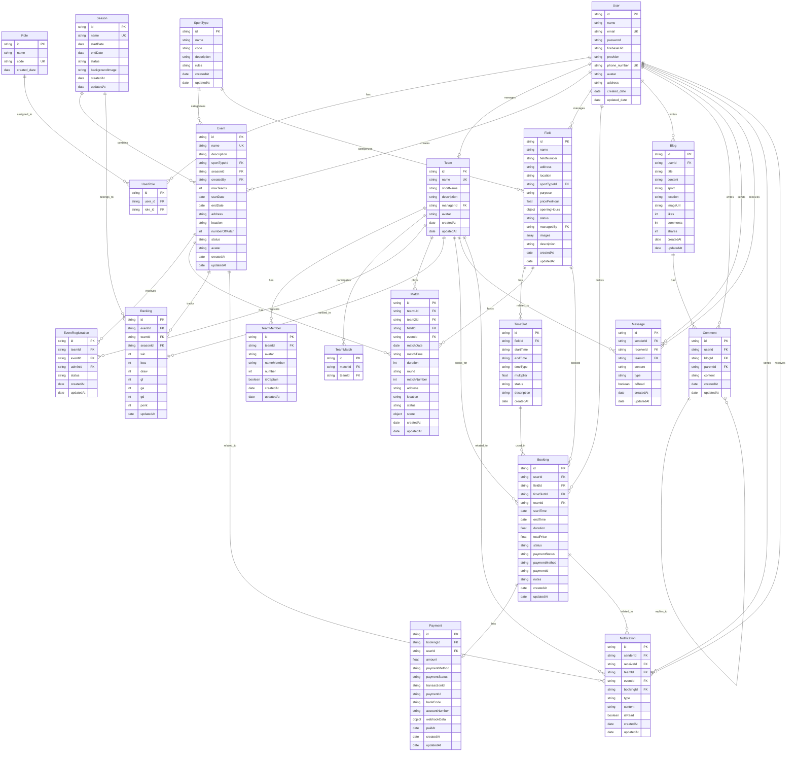

# Database Design - ERD Diagram

## Key Relationships Summary

### User & Authentication
- **User** ↔ **UserRole** ↔ **Role**: Many-to-many relationship for role-based access control

### Team Management
- **User** (manager) → **Team** (1:1, unique constraint)
- **Team** → **TeamMember** (1:many)
- **Team** ↔ **TeamMatch** ↔ **Match** (many-to-many participation)

### Event Management
- **Season** → **Event** (1:many)
- **SportType** → **Event** (1:many)
- **SportType** → **Field** (1:many)
- **User** (admin) → **Event** (1:many, createdBy)
- **Event** ↔ **EventRegistration** ↔ **Team** (many-to-many registration)
- **Event** → **Match** (1:many)
- **Event** → **Ranking** (1:many)
- **Season** → **Ranking** (1:many)

### Field & Booking
- **User** (admin/staff) → **Field** (1:many, managedBy)
- **Field** → **TimeSlot** (1:many)
- **User** → **Booking** (1:many)
- **Field** → **Booking** (1:many)
- **TimeSlot** → **Booking** (1:many)
- **Team** → **Booking** (1:many, optional)
- **Booking** → **Payment** (1:1)

### Social Features
- **User** → **Blog** (1:many)
- **Blog** → **Comment** (1:many)
- **User** → **Comment** (1:many)
- **Comment** → **Comment** (self-referential, parentId for replies)

### Communication
- **User** ↔ **Message** (many-to-many, senderId/receiveId)
- **User** ↔ **Notification** (many-to-many, senderId/receiveId)
- **Team**, **Event**, **Booking** can be referenced in notifications

